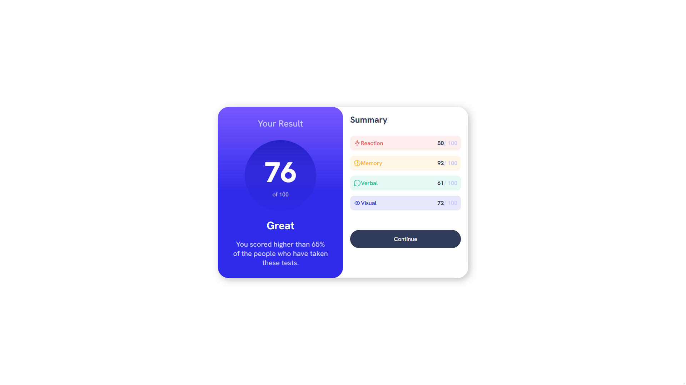
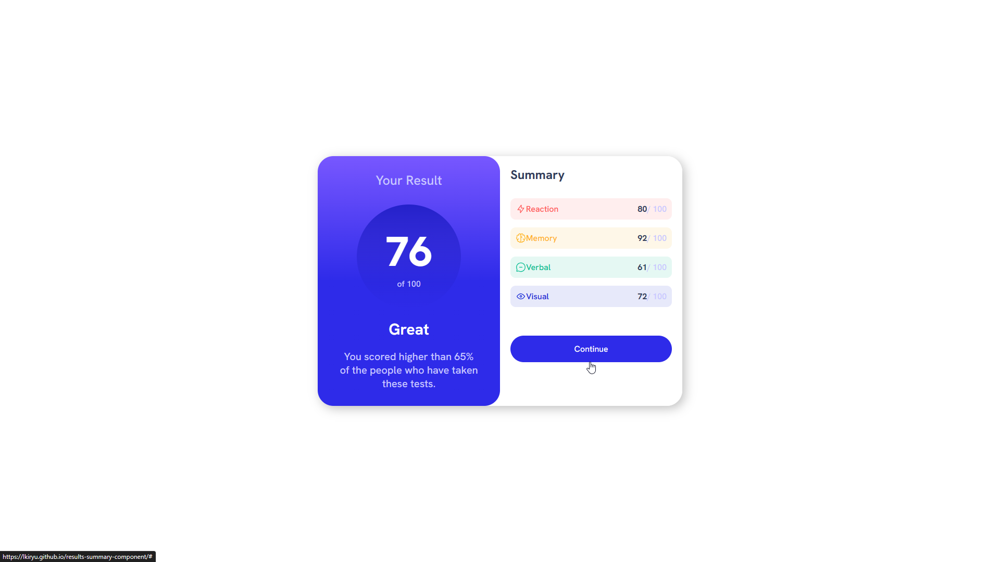
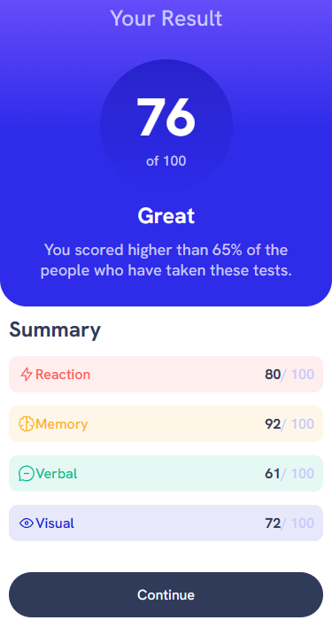

# Frontend Mentor - Results summary component solution

This is a solution to the [Results summary component challenge on Frontend Mentor](https://www.frontendmentor.io/challenges/results-summary-component-CE_K6s0maV). Frontend Mentor challenges help you improve your coding skills by building realistic projects. 

## Overview

### The challenge

Users should be able to:

- View the optimal layout for the interface depending on their device's screen size
- See hover and focus states for all interactive elements on the page

### Screenshot 📷
#### Desktop Screenshot 🖥️

#### With Hover 

#### Mobile Screenshot 📱

### link 🔗
- Live Site URL: https://lkiryu.github.io/results-summary-component/

### Built with 🛠️
- HTML5
- CSS
---
### Author 👨‍💻
 Made by Matheus Antonio